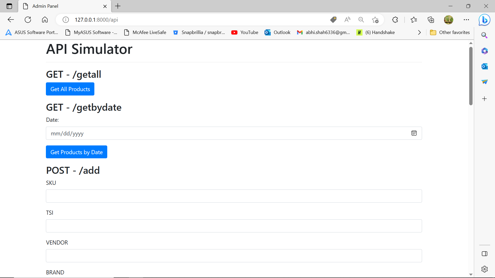

# Admin Panel

## Description
Admin Panel is a web application that provides a user-friendly interface for managing administrative tasks. It is built using [insert technologies and frameworks used in the project].

This repository contains the source code and documentation for the Admin Panel.

## Features
- [List the key features of the admin panel]

## Guidelines
1. Ensure to install Laravel, which is a PHP framework required for this project.

2. To run the project, make sure you have Composer installed.

3. Ensure that MySQL server is running on port 3306 and Redis server is also running.

4. The password for the MySQL server should be set to `root`, and the username should be `root`.

5. Create a database named `laravel` in your MySQL server.

6. Run the following command to migrate the necessary database tables:

7. After migrating the tables, start the Laravel development server by running the following command:

8. Open your browser and visit `localhost` or `127.0.0.1:8000/admin` to access the admin panel.

## Installation
1. Clone the repository: `git clone https://github.com/ashah04-ysu/admin-panel.git`
2. Navigate to the project directory: `cd admin-panel`
3. [Add any specific installation steps if required, such as installing dependencies]

## Usage
1. [Provide instructions on how to use the admin panel]
2. [Include screenshots or examples if necessary]

### Screenshots

### API Call Demo
[Provide a brief description of the API call demo and include a code snippet or example]

## Contributing
Contributions are welcome! If you find any bugs or have suggestions for improvements, please open an issue or submit a pull request. Ensure that you follow the project's coding conventions and style.

Please refer to our [contribution guidelines](CONTRIBUTING.md) for more details.

## License
This project is licensed under the MIT License. See the [LICENSE](LICENSE) file for more information.

## Contact
- [Your Name](mailto:youremail@example.com)

Feel free to contact us if you have any questions or feedback.

## Acknowledgements
[Optional: Acknowledge any external resources or libraries used in the project]
