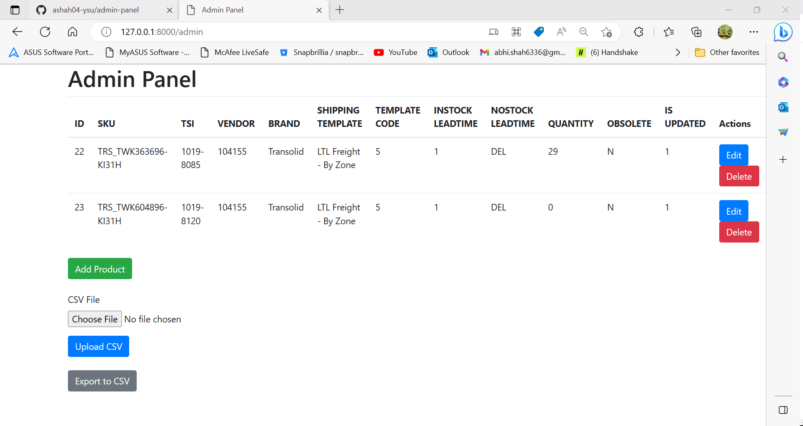

# Admin Panel

## Description
Admin Panel is a web application that provides a user-friendly interface for managing administrative tasks.

This repository contains the source code and documentation for the Admin Panel.

## Features
1. Add/Edit/Delete functionality for managing the data.
2. Data upload functionality from a CSV file.
3. Data export functionality to CSV.

## Guidelines
1. Ensure you have Laravel: PHP Framework installed.

## Installation
1. Clone the repository: `git clone https://github.com/ashah04-ysu/admin-panel.git`
2. Navigate to the project directory: `cd admin-panel`
3. Ensure you have Laravel, Composer installed along with the required libraries such as `league/csv`.
4. Make sure you have MySQL server running on port 3306.
5. Create a database named `laravel` in your MySQL server.
6. Migrate the necessary database tables:
7. After migrating the tables, start the Laravel development server.
8. Open your browser and visit `localhost` or `127.0.0.1:8000/admin` to access the admin panel.

### Screenshots

### API Endpoints
The following API endpoints are available for interacting with the data table:

1. `GET /getall`: Returns a JSON array with all the data.
2. `GET /getbydate`: Accepts a form and a "to" date as parameters to return filtered data by date.
3. `POST /add`: Accepts a JSON payload in the request body and adds a new record.
4. `PUT /update`: Accepts a JSON payload in the request body and updates an existing record matched with the SKU.
5. `DELETE /delete`: Deletes a record by SKU.

## License
This project is licensed under the MIT License. See the [LICENSE](LICENSE) file for more information.

## Contact
- Abhishek Shah(mailto:abhi.shah6336@gmail.com)

Feel free to contact me if you have any questions or feedback.

## Acknowledgements
[Optional: Acknowledge any external resources or libraries used in the project]
